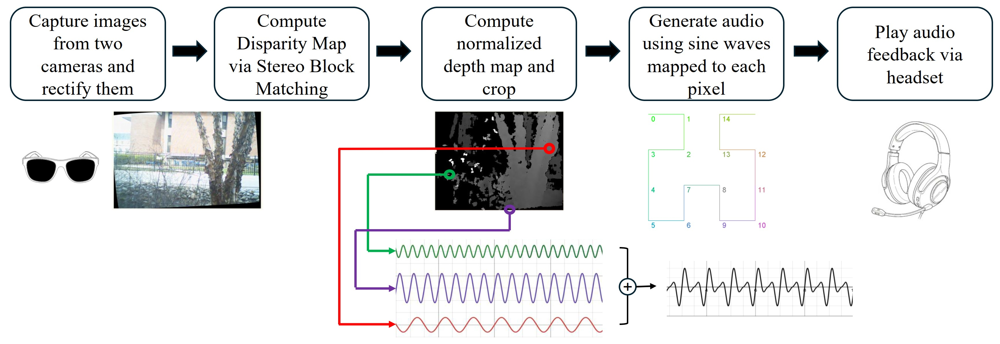

# SightBySound



Depth Map Sonification: This project generates audio from grayscale depth maps using a Hilbert curve traversal. Each pixel is associated with a frequency based on its position, and the pixel's brightness modulates the volume of the frequency. The final audio output is a composite of all the mapped frequencies, allowing the depth information to be perceived through sound.

## :loudspeaker: News
- January 7, 2026: SightBySound project is live! :tada:

## :sparkles: Features

- Depth-to-audio conversion via Hilbert curve
- Debug and timing modes for performance testing
- Customizable experiments for different settings
- Data collection and analysis tools

## :rocket: Getting Started

### :package: Dependencies

- [OpenCV 4+](https://opencv.org)
- [OpenAL](https://openal.org) or [OpenAL Soft](https://openal-soft.org/)

### :clipboard: Prerequisites

- Two statically mounted cameras
- A speaker
- A C++ compiler (e.g., `g++`)
- `cmake` version 3.28 or above

### :hammer_and_wrench: Compiling and Running

#### Build project:
```bash
mkdir build
cmake -B ./build -S .
cmake --build ./build
```

### Run project
```bash
./build/main
```

### Run gtests to ensure proper setup
```bash
./build/gtests/sbstests
```

Ensure camera dynamic link refers to the correct path on different computers

## :open_file_folder: Repository Structure

```text
.
├── 📂 include/                 # Header files (core logic, audio, image processing interfaces)
│   ├── 📄 audio.h              # Audio synthesis / playback interface
│   ├── 📄 hilbert.h            # Hilbert curve mapping utilities
│   ├── 📄 image_processing.h   # Image → grayscale/depth processing
│   └── 📄 ...                  # Other module headers
│
├── 📂 src/                     # Implementation files
│   ├── 📄 main.cpp             # Entry point: runs full pipeline (image → sound)
│   ├── 📄 audio.cpp            # Audio generation + playback logic
│   ├── 📄 hilbert.cpp          # Hilbert curve traversal implementation
│   ├── 📄 image_processing.cpp # Image preprocessing + transformations
│   ├── 📄 settings.cpp         # Parameter tuning / experimentation
│   └── 📄 ...                  # Additional implementation files
│
├── 📂 assets/                  # Input images / test data for experiments
│   └── 📄 ...                  # Example images used for sonification
│
├── 📂 build/                   # Build output (generated by CMake, ignored in git)
|   ├── 📂 gtests/                  # Google Test files for unit testing core components
│   |   └── 📄 ...                  # Test cases (Hilbert mapping, audio, etc.)
|   ├── 📄 main                 # Compiled executable
│
├── 📄 CMakeLists.txt           # Build configuration (CMake project setup)
├── 📄 .gitignore               # Git ignore rules
└── 📄 README.md                # Project overview, theory, and usage
```

## :date: To Do:

<dl>
  <dt></dt>
  <dd><span aria-hidden="true">:hourglass_flowing_sand:</span> Clean up and add documentation to camera calibration scripts, rename test folder </dd>
  
  <dt></dt>
  <dd><span aria-hidden="true">:hourglass_flowing_sand:</span> Move FunctionTimer static library to separate repository</dd>
</dl>


## :scroll: Citation

```text
@inproceedings{Ingco2026Sight,
  author    = {Ingco, M. and Yoon, S.},
  title     = {Sight By Sound: Real-Time Sonification of Stereo Depth Maps using Hilbert Curves for Assistive Navigation supported by a Virtual Training Environment},
  booktitle = {Proceedings of the 2026 IEEE International Conference on Artificial Intelligence and eXtended and Virtual Reality (AIxVR)},
  year      = {2026},
  month     = {Jan},
  address   = {Osaka, Japan},
  note      = {January 26--28},
  publisher = {IEEE}
}
```


